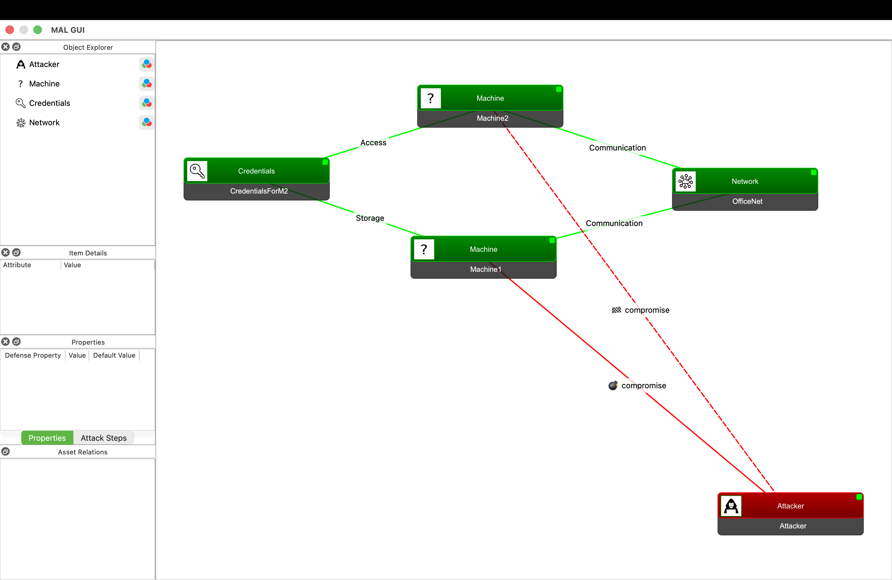

# Tutorial 3 - How to use the mal-gui
The [mal-gui](https://github.com/mal-lang/mal-gui) is a graphical user interface tool used to create MAL instance models and scenarios. In this tutorial we will learn how to use it.

## Installation
1. In your working directory, create a virtual environment and activate it.
- On Linux-based operating systems:
```
python -m venv venv
source venv/bin/activate
```
- On Windows:
```
python -m venv venv
.\venv\Scripts\activate
```
3. Install the mal-gui package: `pip install mal-gui`. This will automatically install `mal-toolbox` and `mal-simulator`.
4. Run the following command to open the app: `malgui`

## Loading a language and creating the model
When we first run the mal-gui, we get the following window:


If you don't know how to create a MAL language, you can follow [Tutorial 1](https://github.com/mal-lang/mal-tutorials/tree/main/tutorials/tutorial1).

For the sake of completeness, we will download and load the same mal-lang used in said tutorial: [exampleLang](https://github.com/mal-lang/exampleLang). We will build the same model as well. If the language has more than one `.mal` file, we will load the main file, usually called `main.mal`. An example of this would be [tyrLang](https://github.com/mal-lang/tyrLang/tree/main).

The next step is to **add assets**. To do so, we can drag and drop new assets from the object explorer on the left. In this case, they are `Network`, `Machine`, and `Credentials`. You can change the name of the assets by double-clicking on each of the individual boxes. We will use the names used in the tutorial 1 model.

Then, we can **create associations** between assets. To do so, press SHIFT while you click on one of the assets, drag to the other asset, and let go. A window will pop up to choose the association type. As we have stated before, we will be adding the tutorial 1 model's associations.


If we closely look at the **asset's icons**, we will quickly notice that `Machine` does not have one. To assign icons to assets, mal-gui has a set of the most typical assets in a networked system: networks, credentials, applications, clients, etc. Then it matches the asset's name to the image's name. You can see all the images [here](https://github.com/mal-lang/mal-gui/tree/main/mal_gui/images). 

Regarding the **association names**, by default, mal-gui uses the general name of the association in the mal-lang only, not the relation name. Here is exampleLang's associations:

```
associations {
    Machine [parties] * <-- Communication --> * [networks] Network
    Machine [storedOn] 0..1 <-- Storage --> * [storesCreds] Credentials
    Machine [authenticates] 0..1 <-- Access --> * [authCreds] Credentials
}
```

As we can see, it uses the `Communication`, `Storage`, and `Access`. If we wanted to see the entire association (so we know we did not mismatch any direction), we can check the `Show Association` box at the upper left corner.


You can also delete connections by right-clicking on them and choosing `Delete Connection`.

## Define a scenario with an attack agent
To define a scenario, we set an **entry point for the attacker**. As in mal-simulator, entry points are associated to a specific instance of an asset and an attack step. To do so, drag and drop the `Attacker` asset from the left menu. To create the same scenario we have in tutorial 1's simulation, create an association with `Machine1` and choose `compromise`.


mal-gui does not allow to run simulations as it is meant for model and scenario creation and visualization.

## Export files
mal-gui allows exporting the models and scenarios we create. If we click on `File` we get the following options:
- *Export Model*: a Save window will be prompted. When the name of the file is chosen, we need to add the extension as well. Choose between .yml, .yaml, or .json.
- *Export Scenario*: same situation as in Export Model.
- *Export draw.io file*: a Save As window will be prompted. In this case, the file extension is already added, so we only need to choose the file name.

## Load a model/scenario directly
mal-gui also allows loading our own model/scenario .yml files. The only difference between model and scenario files is that the scenario file also includes information about the agents and the simulation. For this example, we have the `example-scenario.yml` file in this repository. It follows the exact same model and agent configuration as tutorial 1.

```yml
lang_file: git@github.com:mal-lang/exampleLang.git
agents:
  Attacker:
    type: attacker
    entry_points:
      - "Machine1:compromise"
    agent_class: TTCSoftMinAttacker
    goals:
      - "Machine2:compromise"

model:
  metadata:
    name: New Model
    langVersion: 0.0.0
    langID: exampleLang
    malVersion: 0.1.0-SNAPSHOT
    MAL-Toolbox Version: 3.0.0
    info: Created by the mal-toolbox model python module.
  assets:
    0:
      name: Machine1
      type: Machine
      associated_assets:
        networks:
          2: OfficeNet
        storesCreds:
          1: CredentialsForM2
      extras:
        position:
          x: -506.0
          y: -423.0
    1:
      name: CredentialsForM2
      type: Credentials
      associated_assets:
        storedOn:
          0: Machine1
        authenticates:
          3: Machine2
      extras:
        position:
          x: -880.0
          y: -552.0
    2:
      name: OfficeNet
      type: Network
      associated_assets:
        parties:
          0: Machine1
          3: Machine2
      extras:
        position:
          x: -75.0
          y: -535.0
    3:
      name: Machine2
      type: Machine
      associated_assets:
        networks:
          2: OfficeNet
        authCreds:
          1: CredentialsForM2
      extras:
        position:
          x: -495.0
          y: -672.0
```

To load the file, press `File` -> `Load Model/Scenario` and select the correct .yml file. We would see the following scenario:
