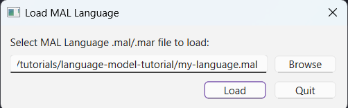
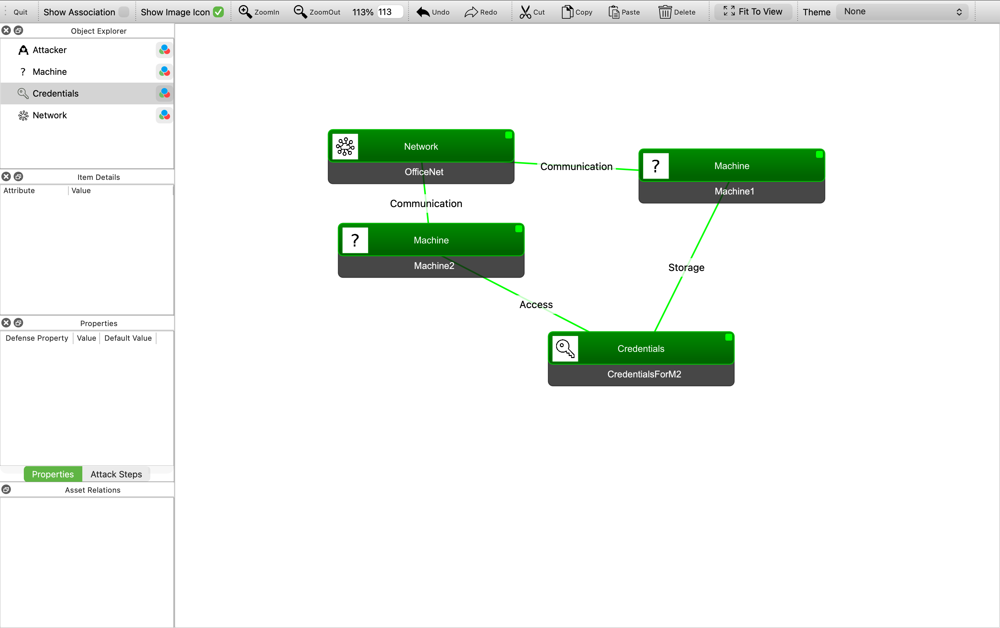
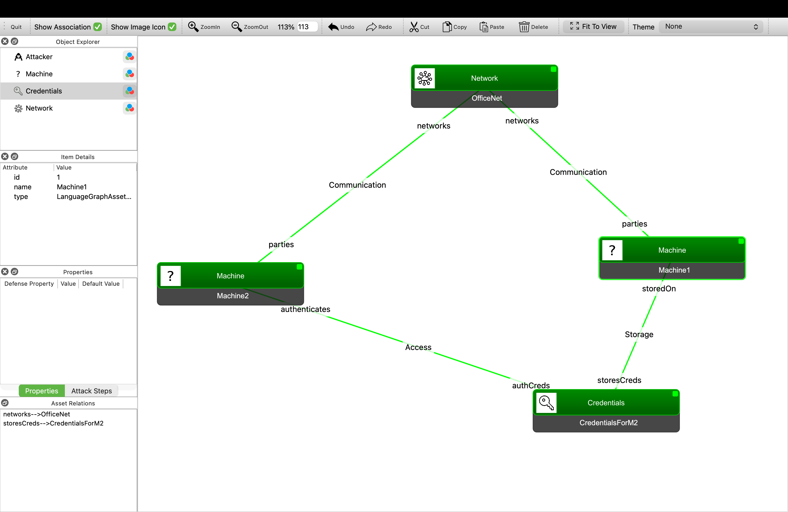
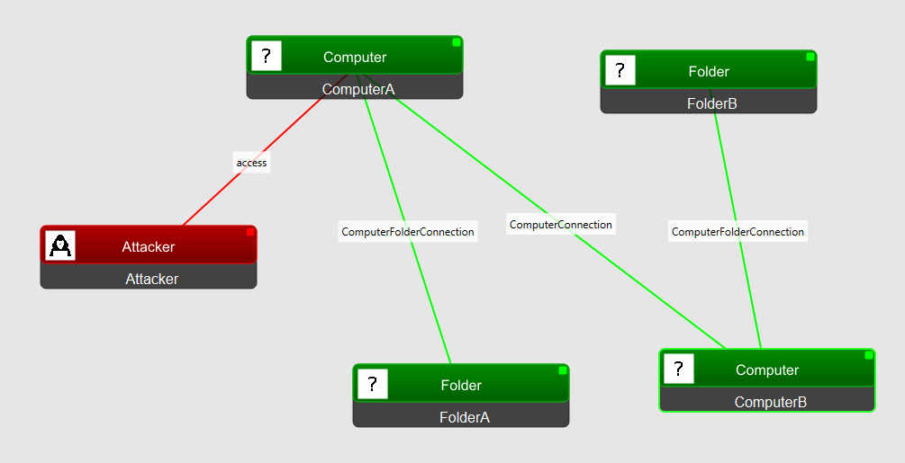

# Tutorial 3 - How to use the mal-gui
The [mal-gui](https://github.com/mal-lang/mal-gui) is a graphical user interface tool used to create MAL instance models and scenarios. In this tutorial we will learn how to use it.

## Installation
1. In your working directory, create a virtual environment and activate it.
- On Linux-based operating systems:
```
python -m venv venv
source venv/bin/activate
```
- On Windows:
```
python -m venv venv
.\venv\Scripts\activate
```
3. Install the mal-gui package: `pip install mal-gui`. This will automatically install `mal-toolbox` and `mal-simulator`.
4. Run the following command to open the app: `malgui`

## Loading a language and creating the model
When we first run the mal-gui, we get the following window:



If you don't know how to create a MAL language, you can follow [Tutorial 1](https://github.com/mal-lang/mal-tutorials/tree/main/tutorials/tutorial1).

For the sake of completeness, we will download and load the same mal-lang used in said tutorial: [exampleLang](https://github.com/mal-lang/exampleLang). We will build the same model as well. If the language has more than one `.mal` file, we will load the main file, usually called `main.mal`. An example of this would be [tyrLang](https://github.com/mal-lang/tyrLang/tree/main).

The next step is to **add assets**. To do so, we can drag and drop new assets from the object explorer on the left. In this case, they are `Network`, `Machine`, and `Credentials`. You can change the name of the assets by double-clicking on each of the individual boxes. We will use the names used in the tutorial 1 model.

Then, we can **create associations** between assets. To do so, press SHIFT while you click on one of the assets, drag to the other asset, and let go. A window will pop up to choose the association type. As we have stated before, we will be adding the tutorial 1 model's associations.



If we closely look at the **asset's icons**, we will quickly notice that `Machine` does not have one. To assign icons to assets, mal-gui has a set of the most typical assets in a networked system: networks, credentials, applications, clients, etc. Then it matches the asset's name to the image's name. You can see all the images [here](https://github.com/mal-lang/mal-gui/tree/main/mal_gui/images). 

Regarding the **association names**, by default, mal-gui uses the general name of the association in the mal-lang only, not the relation name. Here is exampleLang's associations:

```
associations {
    Machine [parties] * <-- Communication --> * [networks] Network
    Machine [storedOn] 0..1 <-- Storage --> * [storesCreds] Credentials
    Machine [authenticates] 0..1 <-- Access --> * [authCreds] Credentials
}
```

As we can see, it uses the `Communication`, `Storage`, and `Access`. If we wanted to see the entire association (so we know we did not mismatch any direction), we can check the `Show Association` box at the upper left corner.



You can also delete connections by right-clicking on them and choosing `Delete Connection`.

## Define a scenario
To define a scenario, we set an entry point for the attacker. To do so, drag and drop the `Attacker` asset from the left menu and create an association with `ComputerA` and choose `access`.


