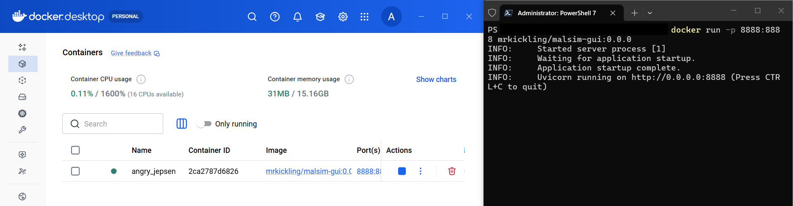
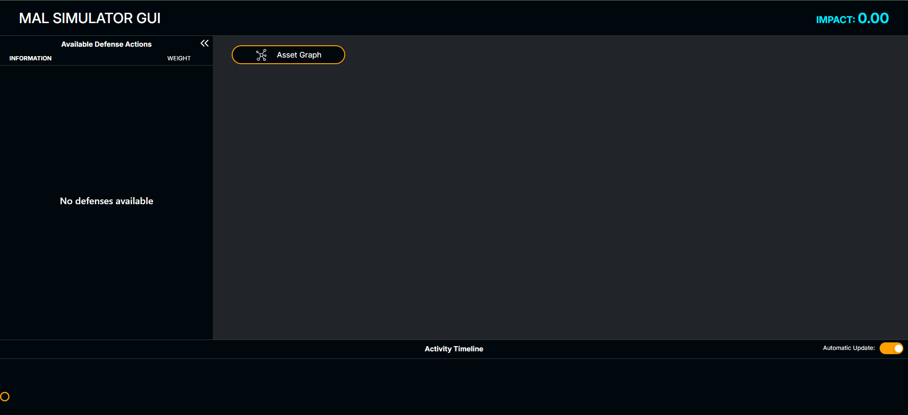
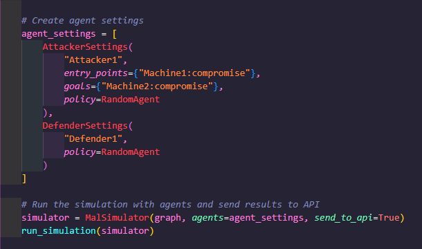
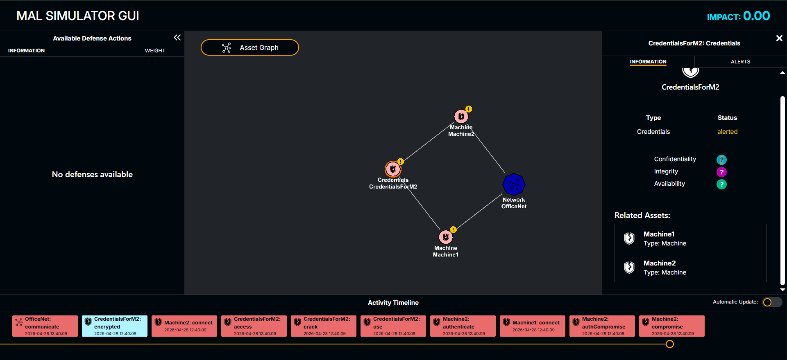
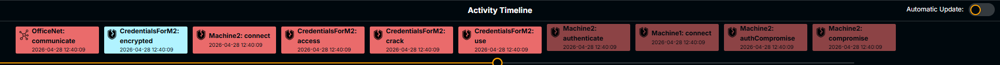
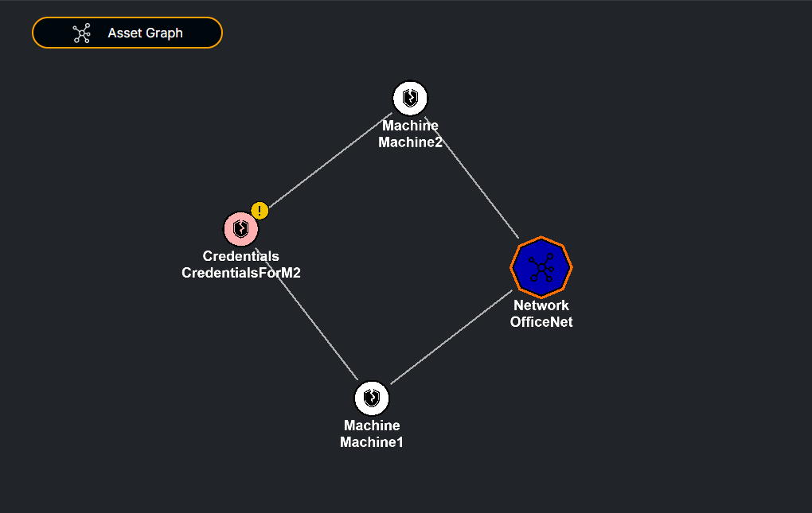
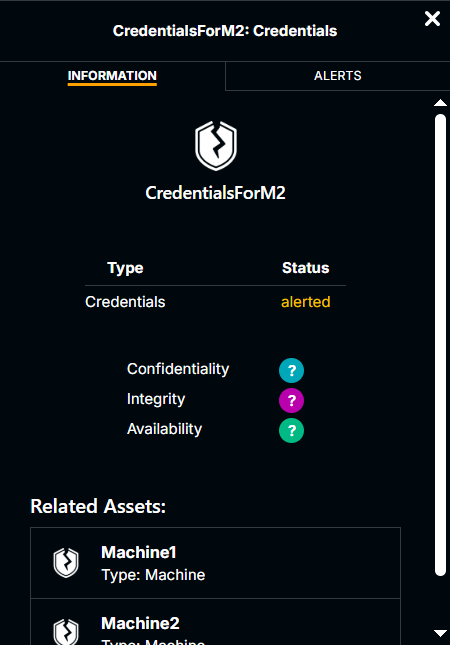
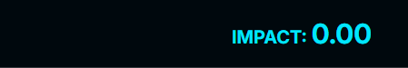

# Tutorial 4 - How to use the MALSIM GUI

In this tutorial we learn how to use the dedicated Graphical User Interface for the MALSIM tool, or malsim-gui. Before starting this tutorial, it is advisable to complete tutorials [1](https://github.com/mal-lang/mal-toolbox-tutorial/blob/main/tutorials/tutorial1/language-model-tutorial.md) and [2](https://github.com/mal-lang/mal-toolbox-tutorial/blob/main/tutorials/tutorial2/model-tutorial.md) on working with MAL languages, models, and simulations. This tutorial uses the malLang, model, attack graph, and simulation created and used in Tutorial 1.

## Starting MALSIM GUI

The most user-friendly way to run the GUI is via Docker. If you would like to run it without using Docker, you might find more information about this How-To, next to more information about this tool, in the malsim-gui dedicated repository: [Link to Repo](https://github.com/mal-lang/malsim-gui)

To proceed with Docker:

- Download and install docker on your system. You will find more info at the [Docker Website](https://www.docker.com/).
- Launch your Docker platform on your machine, open your terminal and run `docker run -p 8888:8888 mrkickling/malsim-gui:0.0.0`. This will automate the downloading of the docker and its launching.

- Once the Docker image is running, you might access the GUI via your browser by opening (http://localhost:8888). At this point, you should be able to see the main view of the GUI:

## Running a Simulation

To run a simulation, we might just follow the steps described in [Tutorial #1](tutorials/tutorial1/language-model-tutorial.md). However, in order to see the simulation-related information on the browser you must do one of the following:
- If you run simulations via script, you will need to pass `send_to_api=True` as an argument when instatiating the MalSimulator() object.

- As an alternative, if you run the simulations from the command line, you will need to use the -g flag.

Regardless of the method chosen to run the simulation, you will need to reaload the browser once you have run the simulation. Then, the data related to the simulation should be visible in the browser. 

## Analyzing the GUI

In the image above we can see how the different areas of the GUI provide different types of information.

### Activity Timeline

In this section of the GUI we can view a timeline of the actions performed by the agents we had previously defined for our simulation.

The orange horizontal scroll bar allows us to move forward and backward in the simulation, in case we want to go to a specific point within it. In this regard, the steps that appear shaded are those that have not yet occurred, and those without shading are those that have already taken place.

### Asset Graph

In this large section of the GUI, we can see a graphical representation of the assets declared in our model, as well as the relationships between them based on asset type.

This is an interactive “panel,” as we can navigate through it by clicking and holding. It also offers the ability to zoom in and out.

Finally, the color of the nodes will change depending on the point in the simulation we are at the [activity timeline](#activity-timeline). If the node is white, it means that at the current moment it has not been compromised; however, if the node is red, this indicates that the node is compromised. By clicking on a node, we can view the alerts section, which can display useful information regarding compromised nodes.

### Node Information & Alerts

In the “Information” tab of this panel, you can view more details about the selected node. For example, you can see the type of asset it is, its current status, and the assets with which it has some kind of relationship.

Additionally, in the case of a compromised node (shown in red), the “Alerts” tab displays the alerts that have been generated for that node. You can also click on each of the displayed alerts to view detailed information related to that specific alert.

### Scoring

Finally, the metric shown in the “Impact” section is the score obtained by the attackers in relation to the rewards included in our scenario.

In this particular case, no rewards have been defined, so the total score or Impact is always 0.
