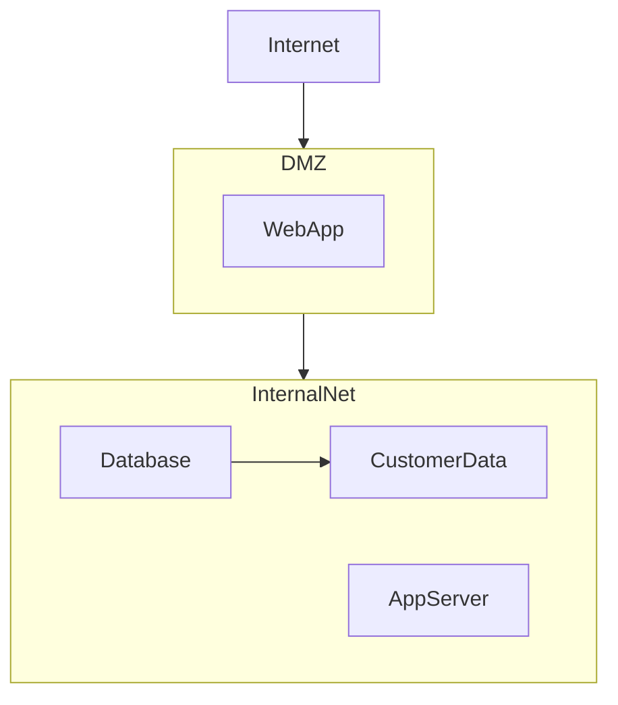
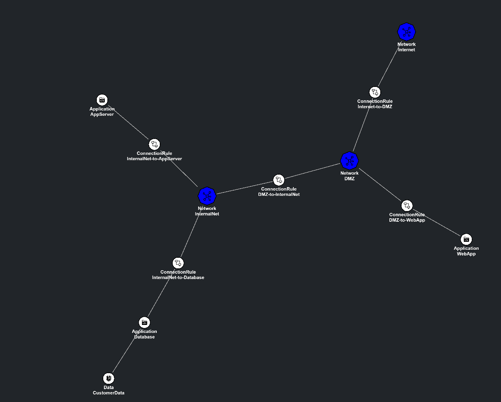
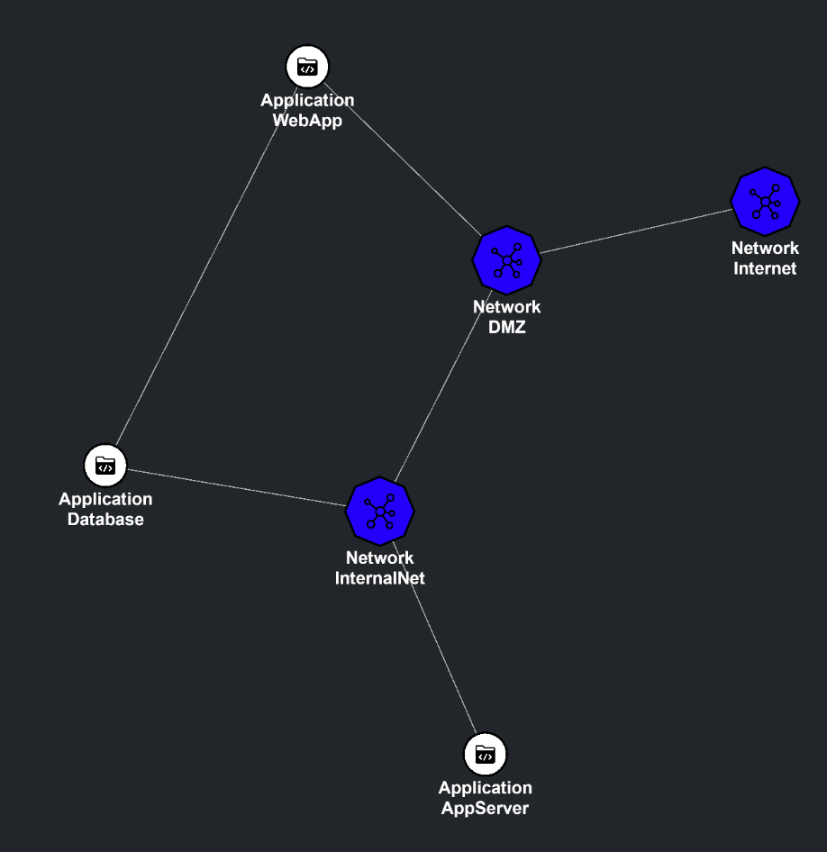
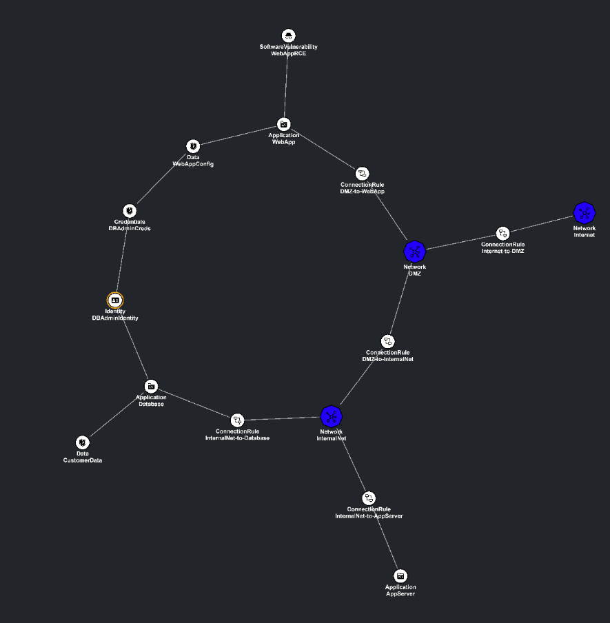
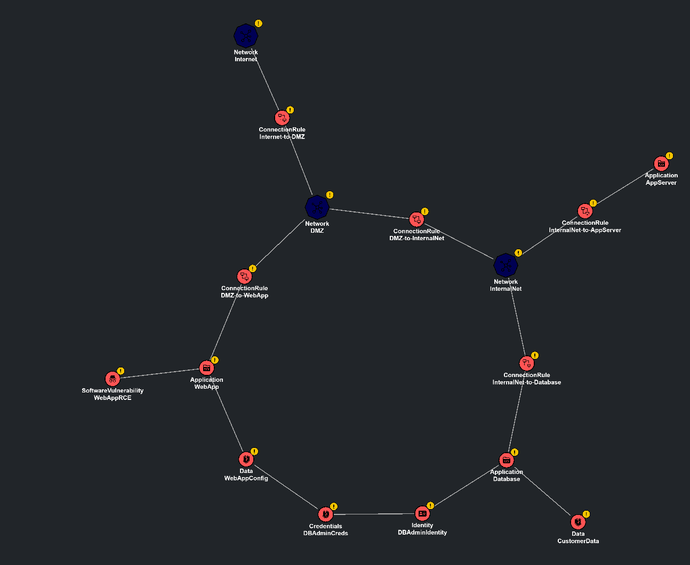
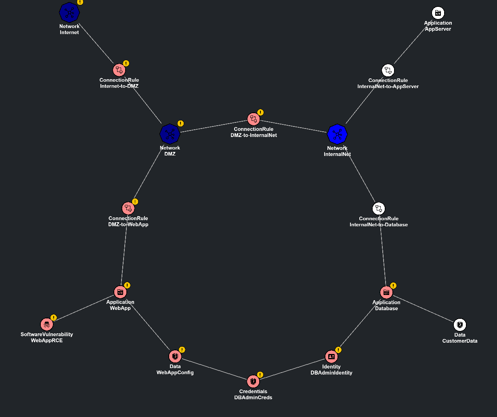
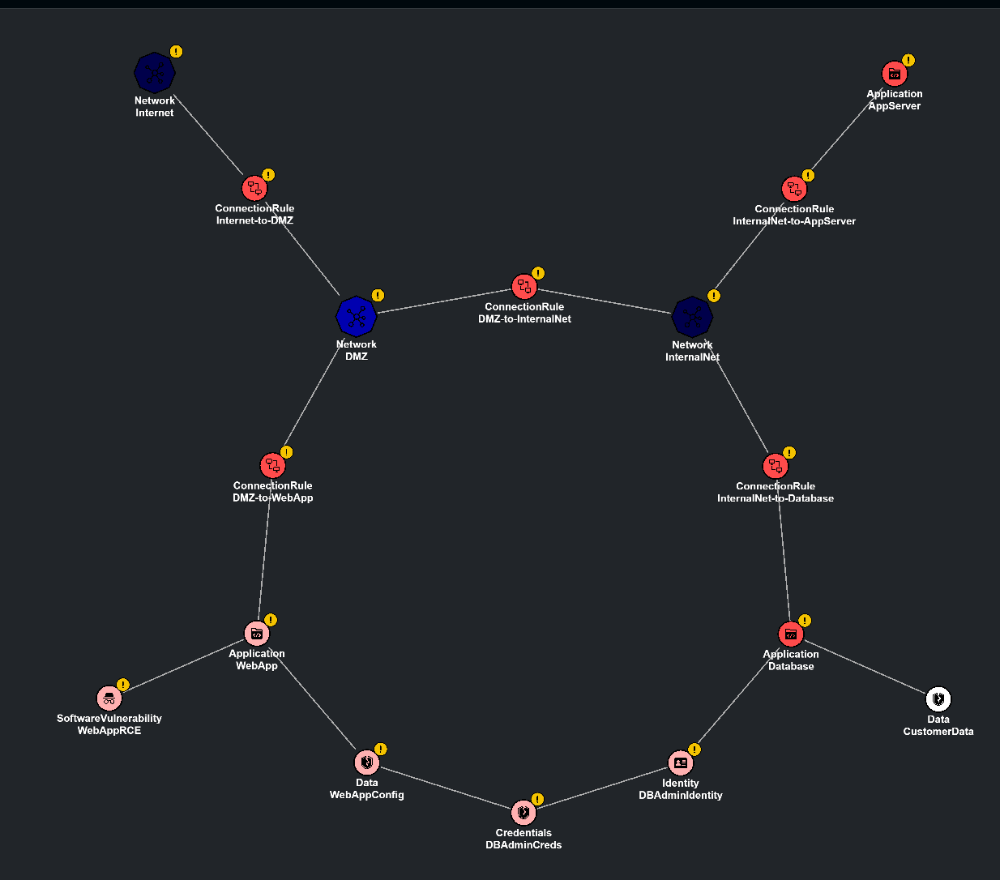
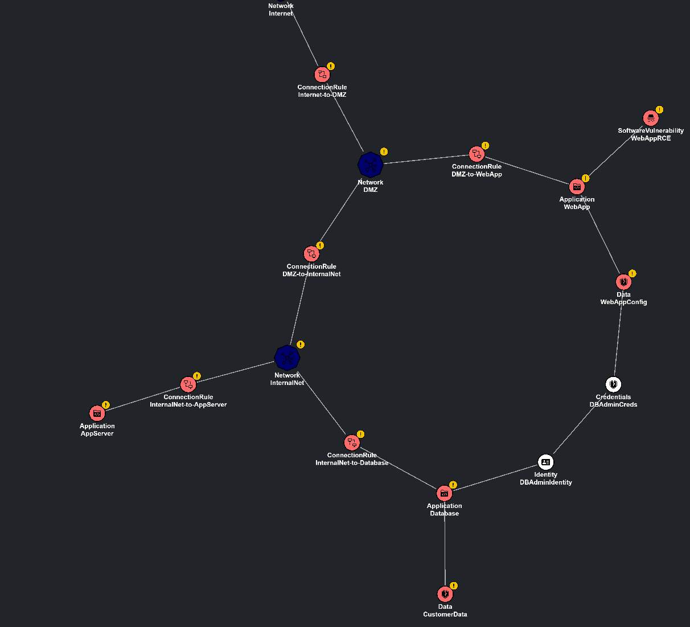
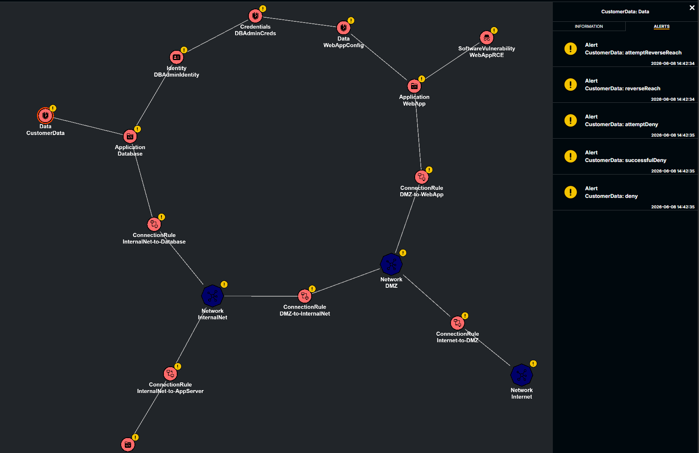

# coreLang Tutorial — Modeling a Real Infrastructure Step‑by‑Step

This tutorial introduces [**coreLang**](https://github.com/mal-lang/coreLang), a [MAL](https://mal-lang.org/) (Meta Attack Language)
domain specific language for modeling IT systems and analyzing attacks. After a short chapter on how
the language works, you will incrementally build a realistic model of an infrastructure.

## Chapter 1 — MAL and coreLang basics

### 1.1 coreLang and its definitions

coreLang is a MAL language that captures the abstract IT domain: applications, hardware, networks, data, identities, credentials, vulnerabilities, etc. It is general enough to describe most modern IT infrastructures (cloud, on‑prem, hybrid, microservices, IoT) at a meaningful abstraction.

The language is split across several `.mal` files that can be found in the [coreLang repository][https://github.com/mal-lang/coreLang/tree/master/src/main/mal]

The current (`1.0.0`) version includes the following files:

| File                   | Description                                                                                                                          |
| ---------------------- | ------------------------------------------------------------------------------------------------------------------------------------ |
| `ComputeResources.mal` | Defines hosts, applications and software products; use to model machines, VMs, containers and where applications run.                |
| `Networking.mal`       | Models networks, connection rules and routing/firewalls; use for subnets, ACLs and allowed traffic flows.                            |
| `DataResources.mal`    | Defines information and data assets; use to model databases, files and sensitive data storage.                                       |
| `IAM.mal`              | Identity and access types: identities, groups, privileges and credentials; model users, service accounts and permission assignments. |
| `User.mal`             | Human actors and user-related attributes; model people and social engineering targets.                                               |
| `Vulnerability.mal`    | Templates for software and hardware vulnerabilities and their exploitation steps; use to model CVEs and exploitability.              |

The entry point is `main.mal` which includes `coreLang.mal`, which in turn includes all
the files above. Therefore, when importing a language in the [MALGUI](https://github.com/mal-lang/mal-gui) to create the model via GUI, this file can be used as an import.

### 1.2 Useful MAL language concepts in coreLang

When you read a `.mal` file, start by looking for five things: how assets are grouped, how a type is defined, how attack steps flow, how defenses are attached, and how assets are linked together. The snippets below show a few example of how to read `.mal` files that define coreLang.

1. **`category`** is the top-level category for related assets.

   From `ComputeResources.mal`:

   ```mal
   category ComputeResources {
   }
   ```

   Here the file defines one category, `ComputeResources`, and all assets in that file belong to it.

2. **`asset`** defines a thing you can model, and `extends` lets it reuse behavior from a parent asset using inheritance.

   From `ComputeResources.mal`:

   ```mal
   asset SoftwareProduct extends Information
   ```

Here `SoftwareProduct` is an asset, and `extends Information` means it inherits the behavior that `Information` already provides. In this case, `Information` is defined in the `DataResources.mal` file.

3. **Attack steps** describe what an attacker can do to or through an asset.

   From `Vulnerability.mal`:

   ```mal
   | attemptAbuse @hidden
     ->  abuse

   & abuse
     ->  attemptExploit

   | exploit
     ->  impact
   ```

   Read the symbols like this: `|` means the step can continue when one parent path succeeds, `&` means all required parent paths must succeed, `@hidden` means the step should be excluded from visualization, and `->` lists the next steps that become available. In this example, the attacker first tries to abuse the vulnerability, then exploit it, and finally reach the impact.

   Concrete flow for this snippet:
   - `attemptAbuse` succeeds, so `abuse` becomes reachable.
   - `abuse` succeeds, so `attemptExploit` becomes reachable.
   - `exploit` succeeds, so `impact` becomes reachable.

   A more concrete step from `ComputeResources.mal` looks like this:

   ```mal
   asset Hardware
   | fullAccess {C,I,A}
     ->  sysExecutedApps.fullAccess,
         hostedData.attemptRead,
         hostedData.attemptWrite,
         deny,
         attemptSpreadWormThroughRemovableMedia
   ```

   Read it as: once the attacker reaches `Hardware.fullAccess`, that success propagates to the linked applications and data. The `{C,I,A}` tag tells you the step affects confidentiality, integrity, and availability, while each item after `->` is a child step that becomes reachable next.

4. **`#`** introduces a defense that can block or make a step harder.

   From `Vulnerability.mal`:

   In coreLang, a defense usually points at the step it protects.

   An example from `Vulnerability.mal` is:

   ```mal
   # networkAccessRequired @suppress [Disabled]
     user info: "Network access is required to abuse the vulnerability."
     ->  networkAccessAchieved,
         softwareProduct.softApplications.softwareProductVulnerabilityNetworkAccessAchieved
   ```

   Here the `#` means the vulnerability is protected by a requirement. If the defense is enabled, the attacker must satisfy the condition before being able to access the next attack steps.

5. **`associations { ... }`** connect assets to each other with named roles.

   From `DataResources.mal`:

```mal
Data [containedData] * <-- AppContainment --> * [containingApp] Application
```

This means a `Data` asset is contained in an `Application`, and the role names become the fields you use in Python (`data.containingApp`, `application.containedData`). The cardinalities tell you that one side can connect to many on the other side.

Essentially, the asset tells you what is being modeled, the attack-step symbols tell you how compromise the asset, the defense syntax tells you what must be true first, and the association syntax tells you how the state of each assets can influence another.

More definitions can be found in the [MAL Syntax page](https://github.com/mal-lang/mal-specification/wiki/MAL-Syntax).

### 1.3 How to work with coreLang in practice

coreLang is the language definition, but the actual modeling workflow usually happens with the support of a variety of MAL tools. Please refer to each repository for instruction on how to install them and their prerequisites.

[MAL Toolbox](https://github.com/mal-lang/mal-toolbox) is a collection of Python modules. Use it when you want to load a language, create a model, add assets and associations, and generate an attack graph from that model. This is the best option when you want the workflow to be repeatable and when you want to build the model step by step in Python code.

[MAL Simulator](https://github.com/mal-lang/mal-simulator) takes the attack graph and runs a simulation on it. That is where attacker and defender agents act on the graph.

If you want to watch the simulation visually, [MAL Sim GUI](https://github.com/mal-lang/malsim-gui) can connect to the simulator and display the simulation as it unfolds.

[MAL GUI](https://github.com/mal-lang/mal-gui) is the visual option. It is useful when you want to explore a model without writing Python first. You can load a language, drag assets into the canvas, create associations visually, and inspect how the attack paths change as the model becomes more complete.

A typical modelling workflow looks like this:

1. Load the coreLang language definition.
2. Create an instance model in Python or in the GUI.
3. Add the assets, associations, entry points, and defenses that describe the scenario.
4. Generate an attack graph from the model.
5. Run a MAL simulation on that attack graph.
6. Inspect the result, either in the console or in MAL Sim GUI, then refine the model and run it again.

## Chapter 2 — Modelling exercise

There cannot be one scenario that will cover everything that the coreLang has to offer and of course, the detail and scope of each model can very greatly. In this tutorial we try to provide a somewhat realistic (even though small) infrastructure to showcase the coreLang capabilities and support tools.

We will not use the [MAL GUI](https://github.com/mal-lang/mal-gui) in this case, but instead we will create the model in code.
We will though, show the simulation on the [MAL Sim GUI](https://github.com/mal-lang/malsim-gui) so that we can more easily show the attack paths.

### 2.1 Scenario

You are modeling the IT infrastructure of **The Company**, a small company with a customer-facing web service. The layout is the following: one
internet-facing application in a DMZ, a backend app server, and a database on a separate internal network.



### 2.2 Setup

This tutorial requires:

- Python version <= 3.12, to code the model and generate the attack paths.
- pip
- Graphviz, to visualize the model and attack paths
- Docker, for MAL-SIM-GUI
- (Optionally) git, for cloning the coreLang repository

Please refer to the approriate tools to see how to install them on your operating system.

Create a directory for the tutorial and set it as your working directory

Create a Python virtual environment and activate it.

- On Linux-based operating systems:

```
python -m venv .venv
source .venv/bin/activate
```

- On Windows:

```
python -m venv .venv
.\.venv\Scripts\activate
```

Install the requirements:

```
pip install mal-toolbox
pip install mal-simulator
```

If you want to run MAL Sim GUI with Docker, start it with:

```
docker run -p 8888:8888 mrkickling/malsim-gui:0.0.0
```

Also you should download the coreLang language by cloning the repository in your working directory.

```
git clone https://github.com/mal-lang/coreLang.git
```

Alternatively you can download the files directly from the repository and place them somewhere convenient.

### 2.3 Adding the assets

Create a file called `model.py` in your tutorial directory. We will now create the `create_model` helper function that defines all our assets.
Start with the imports and the function signature and creating an empty model:

In this chapter we first declare all assets, then wire them with associations in §2.4.
The `lang` object is passed into `create_model`; loading `LanguageGraph` is shown in §2.5.

```python
from maltoolbox.language import LanguageGraph
from maltoolbox.model import Model

def create_model(lang: LanguageGraph) -> Model:
    model = Model("the-company", lang)
    return model
```

#### Networks: Internet, DMZ, InternalNet

The three networks define the topology. In coreLang a **`Network`** is a zone that can contain or expose applications. In our modelling we create 3 networks to match the diagram of the our IT infrastructure.

- **`Internet`** is the untrusted outside zone. This is where the attacker will have his entrypoint, as often happens.
- **`DMZ`** is a semi-trusted perimeter zone. Services here are intentionally exposed to the Internet but should not have direct access to internal resources.
- **`InternalNet`** is the private backend zone. It should never be reachable directly from the Internet. This is a lot of times the case for companies IntraNets as well.

We then add these assets to our script.

```python
from maltoolbox.language import LanguageGraph
from maltoolbox.model import Model

def create_model(lang: LanguageGraph) -> Model:
    model = Model("the-company", lang)
    internet    = model.add_asset("Network", "Internet")
    dmz         = model.add_asset("Network", "DMZ")
    internalnet = model.add_asset("Network", "InternalNet")
    return model
```

#### WebApp

**`Application`** is the most versatile asset in coreLang: it models any
running software process. `WebApp` lives in the DMZ and is the only service
intentionally reachable from the Internet.

```python
from maltoolbox.language import LanguageGraph
from maltoolbox.model import Model

def create_model(lang: LanguageGraph) -> Model:
    model = Model("the-company", lang)

    internet    = model.add_asset("Network", "Internet")
    dmz         = model.add_asset("Network", "DMZ")
    internalnet = model.add_asset("Network", "InternalNet")

    webapp = model.add_asset("Application", "WebApp")

    return model
```

#### ConnectionRules

A **`ConnectionRule`** is a `Networking` asset used to model firewall rules between Applications and/or Networks. We declare one rule for each allowed traffic path.

```python
from maltoolbox.language import LanguageGraph
from maltoolbox.model import Model

def create_model(lang: LanguageGraph) -> Model:
    model = Model("the-company", lang)

    internet    = model.add_asset("Network", "Internet")
    dmz         = model.add_asset("Network", "DMZ")
    internalnet = model.add_asset("Network", "InternalNet")

    webapp = model.add_asset("Application", "WebApp")

    cr_internet_dmz          = model.add_asset("ConnectionRule", "Internet-to-DMZ")
    cr_dmz_webapp            = model.add_asset("ConnectionRule", "DMZ-to-WebApp")
    cr_dmz_internalnet       = model.add_asset("ConnectionRule", "DMZ-to-InternalNet")
    cr_internalnet_appserver = model.add_asset("ConnectionRule", "InternalNet-to-AppServer")
    cr_internalnet_db        = model.add_asset("ConnectionRule", "InternalNet-to-Database")

    return model
```

#### AppServer and Database

Both are **`Application`** assets that live on `InternalNet`. The AppServer is the app backend and handles the logic between the WebApp and the Database. the Database stores the sensitive data and is therefore the most valuable asset in the model.

```python
from maltoolbox.language import LanguageGraph
from maltoolbox.model import Model

def create_model(lang: LanguageGraph) -> Model:
    model = Model("the-company", lang)

    internet    = model.add_asset("Network", "Internet")
    dmz         = model.add_asset("Network", "DMZ")
    internalnet = model.add_asset("Network", "InternalNet")


    webapp = model.add_asset("Application", "WebApp")
    appserver = model.add_asset("Application", "AppServer")
    db        = model.add_asset("Application", "Database")

    cr_internet_dmz          = model.add_asset("ConnectionRule", "Internet-to-DMZ")
    cr_dmz_webapp            = model.add_asset("ConnectionRule", "DMZ-to-WebApp")
    cr_dmz_internalnet       = model.add_asset("ConnectionRule", "DMZ-to-InternalNet")
    cr_internalnet_appserver = model.add_asset("ConnectionRule", "InternalNet-to-AppServer")
    cr_internalnet_db        = model.add_asset("ConnectionRule", "InternalNet-to-Database")

    return model
```

#### CustomerData

**`Data`** in coreLang models a piece of stored information. In our case, the `CustomerData` will serve as the attacker's ultimate goal.

```python
from maltoolbox.language import LanguageGraph
from maltoolbox.model import Model

def create_model(lang: LanguageGraph) -> Model:
    model = Model("the-company", lang)

    internet    = model.add_asset("Network", "Internet")
    dmz         = model.add_asset("Network", "DMZ")
    internalnet = model.add_asset("Network", "InternalNet")

    webapp = model.add_asset("Application", "WebApp")
    appserver = model.add_asset("Application", "AppServer")
    db        = model.add_asset("Application", "Database")

    cr_internet_dmz          = model.add_asset("ConnectionRule", "Internet-to-DMZ")
    cr_dmz_webapp            = model.add_asset("ConnectionRule", "DMZ-to-WebApp")
    cr_dmz_internalnet       = model.add_asset("ConnectionRule", "DMZ-to-InternalNet")
    cr_internalnet_appserver = model.add_asset("ConnectionRule", "InternalNet-to-AppServer")
    cr_internalnet_db        = model.add_asset("ConnectionRule", "InternalNet-to-Database")

    customer_data = model.add_asset("Data", "CustomerData")

    return model
```

#### Partial result

Your `model.py` should now look like this with a little reordering and some extra comments:

```python
from maltoolbox.language import LanguageGraph
from maltoolbox.model import Model

def create_model(lang: LanguageGraph) -> Model:
    model = Model("the-company", lang)

    # Zones
    internet    = model.add_asset("Network", "Internet")
    dmz         = model.add_asset("Network", "DMZ")
    internalnet = model.add_asset("Network", "InternalNet")

    # Applications
    webapp    = model.add_asset("Application", "WebApp")
    appserver = model.add_asset("Application", "AppServer")
    db        = model.add_asset("Application", "Database")

    # Connection rules (one per allowed traffic path)
    cr_internet_dmz          = model.add_asset("ConnectionRule", "Internet-to-DMZ")
    cr_dmz_webapp            = model.add_asset("ConnectionRule", "DMZ-to-WebApp")
    cr_dmz_internalnet       = model.add_asset("ConnectionRule", "DMZ-to-InternalNet")
    cr_internalnet_appserver = model.add_asset("ConnectionRule", "InternalNet-to-AppServer")
    cr_internalnet_db        = model.add_asset("ConnectionRule", "InternalNet-to-Database")

    # Attacker goal
    customer_data = model.add_asset("Data", "CustomerData")

    return model
```

### 2.4 Connecting the assets with associations

#### How associations work in MAL

Before wiring the assets, let's see how an association is expressed in MAL. Open `Networking.mal` and find this line in the `associations` block:

```mal
Network [networks] * <-- NetworkConnection --> * [netConnections] ConnectionRule
```

The format is:

```
LeftAsset [leftRole] leftMult <-- AssociationName --> rightMult [rightRole] RightAsset
```

- `LeftAsset` / `RightAsset` — the two asset types being linked.
- `leftRole` (`networks`) — the name you use **from a `RightAsset`** to
  navigate to its connected `LeftAsset` objects.
- `rightRole` (`netConnections`) — the name you use **from a `LeftAsset`** to
  navigate to its connected `RightAsset` objects.
- The multiplicities (`*`, `0..1`, etc.) state how many instances can
  participate on each side.

In plain English this association reads: _"Any number of `ConnectionRule`s can
connect any number of `Network`s. From a `Network`, use `netConnections` to
reach its `ConnectionRule`s; from a `ConnectionRule`, use `networks` to reach
the `Network`s it connects."_

In Python, `add_associated_assets(role, {targets})` takes the role name that
describes the target assets **as seen from the calling object**. This gives us
our first associations — the `ConnectionRule` bridging `Internet` and `DMZ`,
registered on both sides:

```python
cr_internet_dmz = model.add_asset("ConnectionRule", "Internet-to-DMZ")
internet.add_associated_assets("netConnections", {cr_internet_dmz})
dmz.add_associated_assets("netConnections",      {cr_internet_dmz})
```

Every subsequent `add_associated_assets` call follows this same pattern:
find the association in the `.mal` file, identify the role name the calling
object uses to refer to the targets, and pass that as the first argument.

#### DMZ → WebApp

The `DMZ-to-WebApp` rule permits traffic from the DMZ zone to reach the WebApp.
We register it on both the `DMZ` (role `netConnections`, from `NetworkConnection`) and the `WebApp` (role `appConnections`, from `ApplicationConnection`).

```python
dmz.add_associated_assets("netConnections",    {cr_dmz_webapp})
webapp.add_associated_assets("appConnections", {cr_dmz_webapp})
```

#### DMZ ↔ InternalNet

This `ConnectionRule` controls traffic between the DMZ and the internal network.
The `restricted` defense on this rule enforces a traffic boundary, generally indicating firewall rules: by default it is disabled and we will leave it like this to simulate the presence of a misconfiguration in the firewall.

```python
dmz.add_associated_assets("netConnections",        {cr_dmz_internalnet})
internalnet.add_associated_assets("netConnections", {cr_dmz_internalnet})
```

#### InternalNet → AppServer

Inside `InternalNet`, traffic is permitted to reach the `AppServer`.

```python
internalnet.add_associated_assets("netConnections", {cr_internalnet_appserver})
appserver.add_associated_assets("appConnections",   {cr_internalnet_appserver})
```

#### InternalNet → Database

The Database is reachable from `InternalNet` — any application on the internal
zone (including the AppServer) can connect to it. This is modeled as a
Network-to-Application `ConnectionRule`.

```python
internalnet.add_associated_assets("netConnections", {cr_internalnet_db})
db.add_associated_assets("appConnections",          {cr_internalnet_db})
```

#### CustomerData inside the Database

`Data` is stored inside an `Application` using the `containingApp` role, defined in `DataResources.mal`. This anchors `CustomerData` to the `Database`.

```python
customer_data.add_associated_assets("containingApp", {db})
```

#### Partial result

```python
from maltoolbox.language import LanguageGraph
from maltoolbox.model import Model

def create_model(lang: LanguageGraph) -> Model:
    model = Model("the-company", lang)

    # Zones
    internet    = model.add_asset("Network", "Internet")
    dmz         = model.add_asset("Network", "DMZ")
    internalnet = model.add_asset("Network", "InternalNet")

    # Applications
    webapp    = model.add_asset("Application", "WebApp")
    appserver = model.add_asset("Application", "AppServer")
    db        = model.add_asset("Application", "Database")

    # Connection rules
    cr_internet_dmz          = model.add_asset("ConnectionRule", "Internet-to-DMZ")
    cr_dmz_webapp            = model.add_asset("ConnectionRule", "DMZ-to-WebApp")
    cr_dmz_internalnet       = model.add_asset("ConnectionRule", "DMZ-to-InternalNet")
    cr_internalnet_appserver = model.add_asset("ConnectionRule", "InternalNet-to-AppServer")
    cr_internalnet_db        = model.add_asset("ConnectionRule", "InternalNet-to-Database")

    # Attacker goal
    customer_data = model.add_asset("Data", "CustomerData")

    # Associations
    internet.add_associated_assets("netConnections",   {cr_internet_dmz})
    dmz.add_associated_assets("netConnections",        {cr_internet_dmz})

    dmz.add_associated_assets("netConnections",    {cr_dmz_webapp})
    webapp.add_associated_assets("appConnections", {cr_dmz_webapp})

    dmz.add_associated_assets("netConnections",        {cr_dmz_internalnet})
    internalnet.add_associated_assets("netConnections", {cr_dmz_internalnet})

    internalnet.add_associated_assets("netConnections", {cr_internalnet_appserver})
    appserver.add_associated_assets("appConnections",   {cr_internalnet_appserver})

    internalnet.add_associated_assets("netConnections", {cr_internalnet_db})
    db.add_associated_assets("appConnections",          {cr_internalnet_db})

    customer_data.add_associated_assets("containingApp", {db})

    return model
```

Quick check in MAL Sim GUI after running `simulation.py`:

- You should now see the assets, connection rules and associations
- Nothing is compromised as we do not have vulnerabilities nor an attacker just yet



### 2.5 Adding vulnerabilities and misconfigurations

A model without flaws has no interesting attack paths.
We introduce four:

- a network misconfiguration — the `DMZ-to-InternalNet` connection rule carries no `restricted` defense, leaving the path from the DMZ to the internal network open
- a technical vulnerability on the `WebApp`
- a credential misconfiguration — database credentials are hard-coded in a `WebApp` config file
- an IAM misconfiguration — the database admin account (`DBAdminIdentity`) is a standing, always-active account with persistent high-privilege access to the database; any attacker who obtains the credentials can immediately assume it

The kill chain requires **all four** to succeed. Disabling any one of them is sufficient to stop the attack.

#### Unrestricted DMZ-to-InternalNet connection

The `DMZ-to-InternalNet` `ConnectionRule` has a `restricted` defense that, when enabled, blocks uninspected traffic from traversing the zone boundary. In this model the defense is left disabled — the default in coreLang. Any attacker who has gained access to the DMZ can immediately forward traffic into `InternalNet` without having to bypass an explicit restriction.

There is no code to add here: the misconfiguration is the _absence_ of the defense line. The defense that fixes it is shown in §2.8.

#### The WebApp RCE vulnerability

A **`SoftwareVulnerability`** in coreLang is a flaw attached to an `Application`. By default, with no defense toggles set, it is network-exploitable and has full CIA impact. The attacker only needs to reach the application over
the network to attempt exploitation.

`WebAppRCE` represents a typical remote code execution flaw, such as an unsanitised input or a known CVE in the webapp stack.

```python
# Vulnerabilities and credentials
webapp_rce = model.add_asset("SoftwareVulnerability", "WebAppRCE")
webapp_rce.add_associated_assets("application", {webapp})
```

#### Misplaced credentials

Here a developer hard-coded the database connection string, including credentials, in a config file on the `WebApp` server.

- **`Identity`** (`DBAdminIdentity`) is the database service account. It has high-privilege access on `Database`, meaning that whoever assumes it gets full access.
- **`Credentials`** (`DBAdminCreds`) is the secret that authenticates as the identity above. It is hard-coded in a config file (`WebAppConfig`) on the `WebApp` server — any attacker who reads the WebApp filesystem will find it.

These would be maybe a bit too convenient for an attacker to find this way, but it serves as an example. Your model could have more nuanced vulnerabilities with extra steps required to gain such high privileges.

```python
dbadmin_id    = model.add_asset("Identity",    "DBAdminIdentity")
dbadmin_creds = model.add_asset("Credentials", "DBAdminCreds")
webapp_config = model.add_asset("Data",        "WebAppConfig")

dbadmin_id.add_associated_assets("highPrivApps", {db})
dbadmin_creds.add_associated_assets("identities",   {dbadmin_id})
webapp.add_associated_assets("containedData",      {webapp_config})
webapp_config.add_associated_assets("information", {dbadmin_creds})
```

#### Running the simulation

Now that we have modelled our infrastructure, it would be good to take a look at it.

We will be using the [MAL Sim GUI](https://github.com/mal-lang/malsim-gui) to visualize the model so far and later on to explore the attack paths.

Please follow the instructions in the repository to install the GUI.

Once everything is set up, create in the tutorial directory a `simulation.py` file that will contain the code to load the `coreLang` language, call our `create_model` function, generate the attack graph, and run the simulation.

Once you created the file copy-paste this code:

```python
import os
from maltoolbox.language import LanguageGraph
from maltoolbox.attackgraph import AttackGraph
from malsim import MalSimulator, run_simulation

from model import create_model

def main():
    # Load the language
    lang_file = "path-to-main.mal-file"
    current_dir = os.path.dirname(os.path.abspath(__file__))
    lang_file_path = os.path.join(current_dir, lang_file)
    coreLang = LanguageGraph.load_from_file(lang_file_path)

    # Create our example model
    model = create_model(coreLang)
    print("Model created successfully!")
    # Generate an attack graph from the model
    graph = AttackGraph(coreLang, model)
    print("Attack graph generated successfully!")

    simulator = MalSimulator(graph, agents=[], send_to_api=True)
    attack_paths = run_simulation(simulator)

    import pprint

    pprint.pprint("Simulation recording:")
    pprint.pprint(simulator.recording)
    pprint.pprint("Attack paths found:")
    pprint.pprint(attack_paths)

if __name__ == "__main__":
    main()
```

Make sure that you change the string `"path-to-main.mal-file"` with the actual path to the `main.mal` file that you downloaded when you downloaded `coreLang`.

Also note this line:

```
simulator = MalSimulator(graph, agents=[], send_to_api=True)
```

We need the `send_to_api=True` flag to make sure that the MAL Sim GUI gets the model. Refresh the browser after running the script with:

```
python simulation.py
```

In the console you should see something like this:

```
Model created successfully!
Attack graph generated successfully!
Simulation over after 0 steps.
'Simulation recording:'
defaultdict(<class 'dict'>, {})
'Attack paths found:'
{}
```

Because no attacker agent is present nothing really happens and the simulation simply ends with 0 steps.
In the GUI though we should be able to see at least the model:



By zooming in and out we can see in more details all the assets that we modelled.



### 2.6 Adding the attacker

Now we add an attacker agent to `simulation.py`. An `AttackerSettings` object describes where the attacker starts (`entry_points`) and what they are trying to reach (`goals`). Update `simulation.py` to the following:

```python
import os
import pprint
from maltoolbox.language import LanguageGraph
from maltoolbox.attackgraph import AttackGraph
from malsim import MalSimulator, run_simulation, AttackerSettings
from malsim.policies import DepthFirstAttacker

from model import create_model

def main():
    lang_file = "./coreLang/src/main/mal/main.mal"
    current_dir = os.path.dirname(os.path.abspath(__file__))
    lang_file_path = os.path.join(current_dir, lang_file)
    coreLang = LanguageGraph.load_from_file(lang_file_path)

    model = create_model(coreLang)
    graph = AttackGraph(coreLang, model)

    attacker = AttackerSettings(
        "Attacker",
        entry_points={"Internet:accessUninspected"},
        goals={"CustomerData:read"},
        policy=DepthFirstAttacker,
    )

    simulator = MalSimulator(graph, agents=[attacker], send_to_api=True)
    run_simulation(simulator)

    pprint.pprint(simulator.recording)

if __name__ == "__main__":
    main()
```

The entry point `Internet:accessUninspected` is the starting position for an external threat actor. The goal `CustomerData:read` is the attack step the agent will try to reach.

Attacker settings used in this tutorial:

- `entry_points={"Internet:accessUninspected"}`: initial attacker foothold.
- `goals={"CustomerData:read"}`: target attack step that ends the run successfully.
- `policy=DepthFirstAttacker`: explores one path deeply before backtracking.

### 2.7 Running the simulation with an attacker

Run the simulation with:

```
python simulation.py
```

When you run the simulation you will see a dictionary printed to the console
where each key is a step number and each value is the attack-graph node
the attacker executed at that step.

We use `DepthFirstAttacker`, which follows the deepest unexplored path at
every step. Its execution order is deterministic on CPython but reflects a
depth-first traversal rather than the causal kill-chain order, so some conjunction
steps that are automatically triggered (e.g. `Database:networkConnect`) may
appear in the recording before the explicit step that caused them (e.g.
`InternalNet:accessUninspected`). The output should look similar to this:

```
{  1: {'Attacker': [AttackGraphNode(name: "Internet:deny", ...)]},
   2: {'Attacker': [AttackGraphNode(name: "Internet-to-DMZ:attemptDeny", ...)]},
   3: {'Attacker': [AttackGraphNode(name: "Internet-to-DMZ:deny", ...)]},
   ...
  90: {'Attacker': [AttackGraphNode(name: "Database:networkConnect", ...)]},
   ...
 114: {'Attacker': [AttackGraphNode(name: "DMZ:accessUninspected", ...)]},
   ...
 126: {'Attacker': [AttackGraphNode(name: "InternalNet:accessUninspected", ...)]},
   ...
 179: {'Attacker': [AttackGraphNode(name: "WebApp:networkConnectUninspected", ...)]},
   ...
 183: {'Attacker': [AttackGraphNode(name: "WebApp:successfulUseVulnerability", ...)]},
   ...
 197: {'Attacker': [AttackGraphNode(name: "WebAppConfig:read", ...)]},
 198: {'Attacker': [AttackGraphNode(name: "DBAdminCreds:read", ...)]},
 200: {'Attacker': [AttackGraphNode(name: "DBAdminCreds:use", ...)]},
 204: {'Attacker': [AttackGraphNode(name: "DBAdminIdentity:assume", ...)]},
 205: {'Attacker': [AttackGraphNode(name: "Database:authenticate", ...)]},
 207: {'Attacker': [AttackGraphNode(name: "Database:networkAccess", ...)]},
 208: {'Attacker': [AttackGraphNode(name: "Database:fullAccess", ...)]},
   ...
 224: {'Attacker': [AttackGraphNode(name: "CustomerData:read", ...)]}}
```

The critical milestones, grouped by phase, are:

**Phase 1 — Attacker enters the DMZ**

| Step | Node                    |
| ---- | ----------------------- |
| 114  | `DMZ:accessUninspected` |

The DFS agent dives immediately into the `Internet-to-DMZ` connection path.
Conjunction steps along the way (such as `successfulAccessNetworksUninspected`) fire
automatically and are not explicit attacker actions; `DMZ:accessUninspected`
is the first step that confirms the DMZ is fully accessible.

**Phase 2 — Crossing into InternalNet** _(misconfiguration #1)_

| Step | Node                                                                     |
| ---- | ------------------------------------------------------------------------ |
| 90   | `Database:networkConnect`                                                |
| 124  | `DMZ-to-InternalNet:successfulAccessNetworksUninspected` _(conjunction)_ |
| 126  | `InternalNet:accessUninspected`                                          |

Because `DepthFirstAttacker` follows the deepest path first, it reaches
`Database:networkConnect` (step 90) before the explicit `InternalNet:accessUninspected`
(step 126) appears in the recording. Both happen as a result of the same deep traversal:
the DFS fires `DMZ-to-InternalNet:attemptAccessNetworksUninspected`, which through the
disabled `restricted` defense (misconfiguration #1) automatically satisfies the conjunction step
and triggers `InternalNet:accessUninspected` → `InternalNet-to-Database` → `Database:networkConnect`
as a cascade. This establishes the first half of the conjunction step needed at phase 5.

**Phase 3 — WebApp RCE** _(misconfiguration #2)_

| Step | Node                                                       |
| ---- | ---------------------------------------------------------- |
| 179  | `WebApp:networkConnectUninspected`                         |
| 180  | `WebApp:softwareProductVulnerabilityNetworkAccessAchieved` |
| 183  | `WebApp:successfulUseVulnerability` _(conjunction)_        |

`WebApp:successfulUseVulnerability` is a conjunction step that fires because
`WebAppRCE` is present and the attacker has uninspected network access —
misconfiguration #2. This gives the attacker code execution on the WebApp,
enabling access to data stored on it.

**Phase 4 — Credential theft and identity assumption** _(misconfigurations #3 and #4)_

| Step | Node                               |
| ---- | ---------------------------------- |
| 197  | `WebAppConfig:read`                |
| 198  | `DBAdminCreds:read`                |
| 200  | `DBAdminCreds:use` _(conjunction)_ |
| 204  | `DBAdminIdentity:assume`           |
| 205  | `Database:authenticate`            |

`DBAdminCreds:read` fires because the credentials are hard-coded in
`WebAppConfig` — misconfiguration #3. `DBAdminIdentity:assume` then fires
because the account is a standing, always-active admin account with no
disable mechanism — misconfiguration #4. Together these produce
`Database:authenticate`, the second half of the conjunction step.

**Phase 5 — Conjunction step satisfied, goal reached**

| Step | Node                                                           |
| ---- | -------------------------------------------------------------- |
| 207  | `Database:networkAccess` _(conjunction — both paths converge)_ |
| 208  | `Database:fullAccess`                                          |
| 224  | `CustomerData:read` ✓                                          |

`Database:networkAccess` is the conjunction step where the two paths meet:
`Database:networkConnect` (from phase 2) and `Database:authenticate`
(from phase 4) must both be true. Once it fires, `Database:fullAccess`
and `CustomerData:read` follow immediately.

The GUI, once refreshed will also display each step in the `Activity Timeline` footer as the attacker
moves through the infrastructure.

To observe attack propagation in MAL Sim GUI:

1. Start the GUI container and open `http://localhost:8888`.
2. Run `python simulation.py` in the tutorial directory.
3. Refresh the GUI page to load the latest run.
4. Follow the `Activity Timeline` and click nodes as they activate.
5. Verify the final step `CustomerData:read` appears.

Once the full timeline is evaluated, all the nodes are compromised.



### 2.8 Stopping the attacker with defenses

The model now has a working kill chain. The next step is to show that enabling specific defenses breaks it. Each defense is a coreLang probability toggle added inside `create_model` in `model.py`. Enable them one at a time, re-run, and compare the results.

Recall that the attack requires **all four** misconfigurations to be present.
Breaking any single link in the chain is sufficient to stop `CustomerData:read`
from being reached. The defenses can be manually toggled, like we will show below or can be toggled by `Defender agent` that is similar to the attacker, but can instead

#### Defense 1 — Restrict the DMZ-to-InternalNet boundary

Enable the `restricted` defense on the `DMZ-to-InternalNet` connection rule.
Add the following inside `create_model` in `model.py`, after creating `cr_dmz_internalnet`:

```python
cr_dmz_internalnet.defenses['restricted'] = 1.0
```

This models adding an explicit firewall rule that blocks uninspected traffic
from forwarding out of the DMZ into the internal network. The attacker can still
reach the DMZ, but `DMZ-to-InternalNet:successfulAccessNetworksUninspected`
can no longer fire — `InternalNet` and everything behind it is unreachable.

Re-run with `python simulation.py`. The attacker is stopped at the DMZ boundary;
`Database:networkConnect` never fires, the conjunction step `Database:networkAccess`
cannot be satisfied, and `CustomerData:read` is unreachable.

In the GUI, we can see that the nodes that connect the Intranet to the DB and also everything else behind it, do not get alerted.



#### Defense 2 — Patch the vulnerability

Remove the previous defense and instead remove the exploitable flaw. In coreLang, a
`SoftwareVulnerability` has a `notPresent` defense: when enabled, the
vulnerability is treated as if it does not exist.

Add the following inside `create_model` in `model.py`, after creating `webapp_rce`:

```python
webapp_rce.defenses['notPresent'] = 1.0
```

Re-run with `python simulation.py`. The attacker can still cross into InternalNet
but `WebApp:successfulUseVulnerability` can no longer fire, so neither
`specificAccess` nor `fullAccess` is reachable from the network. The credential
theft path collapses and `CustomerData:read` is unreachable.

IN the GUI, propagation reaches but does not trigger the `CustomerData`.



#### Defense 3 — Remove credentials from the config file

Remove the previous defense and instead mark `WebAppConfig` as not present:

```python
webapp_config.defenses['notPresent'] = 1.0
```

This models moving the database credentials out of the plain-text config file
and into a secrets manager or runtime injection mechanism. The `WebAppConfig`
Data asset is treated as if it no longer holds credentials, so even after
gaining `WebApp:fullAccess` the attacker finds nothing to steal.

Re-run with `python simulation.py`. The attacker still compromises `WebApp`
fully, but `WebAppConfig:read` no longer propagates to `DBAdminCreds:read`.
`DBAdminIdentity` cannot be assumed, `Database:authenticate` never fires, and
`Database:networkAccess` cannot be satisfied — `CustomerData:read`
is unreachable.

In the GUI, propagation reaches WebApp compromise but stops before credential use/identity assumption.
The `CustomerData` node is notified but no Read operation can occur.



#### Defense 4 — Disable the standing database admin account

Remove the previous defense and instead mark `DBAdminIdentity` as not present:

```python
dbadmin_id.defenses['notPresent'] = 1.0
```

This models eliminating the standing database admin account — replacing it
with just-in-time access provisioning, certificate-based authentication, or
removing the shared admin account entirely. Even if the attacker successfully
exploits the RCE and reads `DBAdminCreds` from the config file, the identity
those credentials authenticate as no longer exists.

Add the line inside `create_model` in `model.py`, after creating `dbadmin_id`.

Re-run with `python simulation.py`. `DBAdminCreds:read` still fires — the
credentials are still in the config — but `DBAdminIdentity:assume` cannot
fire because the identity is absent. `Database:authenticate` never fires,
`Database:networkAccess` cannot be satisfied and
`CustomerData:read` is unreachable.

In the GUI, the nodes are alerted, but the attacker still cannot read the `CustomerData`.


